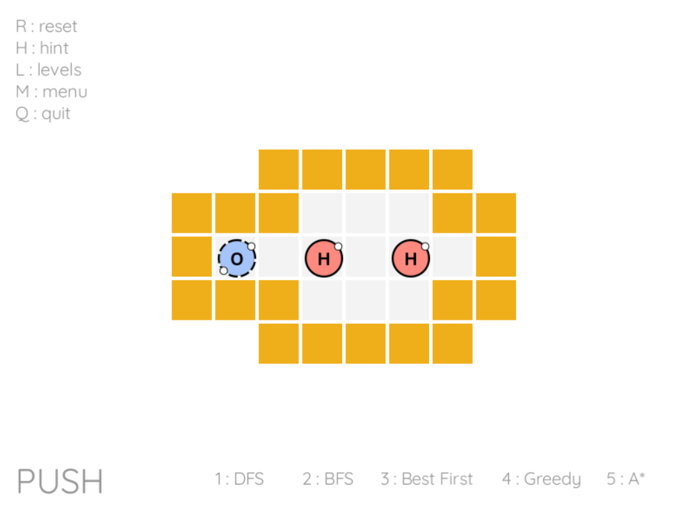
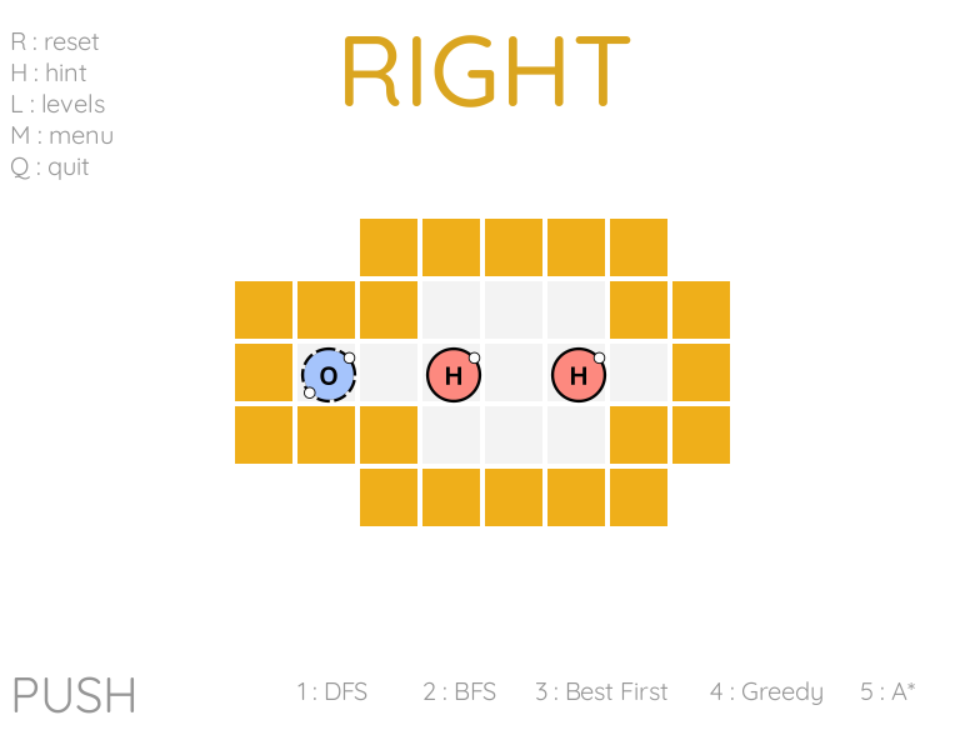

# Sokobond with heuristic Search Methods 

<div style="text-align: center;">
    
</div>

- [Sokobond with heuristic Search Methods](#sokobond-with-heuristic-search-methods)
  - [Summary](#summary)
  - [Installation and usage](#installation-and-usage)
  - [Game Controls](#game-controls)
  - [Algorithms controls](#algorithms-controls)
  - [Hint - AI Assistance](#hint---ai-assistance)
  - [Definition of the game](#definition-of-the-game)
  - [Formulation of the problem as a search problem](#formulation-of-the-problem-as-a-search-problem)
  - [Uninformed search methods](#uninformed-search-methods)
    - [Depth-First Search (DFS)](#depth-first-search-dfs)
    - [Breadth-First Search (BFS)](#breadth-first-search-bfs)
  - [Informed search methods](#informed-search-methods)
    - [Best-first Search](#best-first-search)
    - [Greedy Algorithm](#greedy-algorithm)
    - [A\* Algorithm](#a-algorithm)
  - [Credits](#credits)


## Summary

The project focuses on developing heuristic search methods for solving one-player solitaire games, with **Sokobond** being the chosen game for implementation. Utilizing Python along with the Pygame library, the project aims to provide both a playable solitaire game for human players and an automated solver capable of tackling various levels of Sokobond puzzles.

In addition to creating an engaging gaming experience, the project emphasizes the implementation of heuristic search algorithms for solving Sokobond puzzles efficiently. Special attention is given to comparing different uninformed search methods to evaluate their effectiveness in solving the game's puzzles.

By combining game development with artificial intelligence techniques, the project provides a platform for exploring and understanding heuristic search methods in the context of puzzle-solving games. Through experimentation and analysis, the project aims to shed light on the strengths and limitations of various search algorithms in tackling challenging solitaire game scenarios.

## Installation and usage

1. Ensure you have Python installed on your system.
2. Install the Pygame library using pip: `pip install pygame`.
3. Download the Sokobond game files from the repository.
4. Run the game script using Python: `python sokobond.py`.

## Game Controls

<div style="text-align: center;">
    
</div>

- **Movement** : Use the arrow keys to move the hero atom.
- **Reset Level** : Press the '**R**' key.
- **Hint** : Press the '**H**' key.
- **Level Menu** : Press the '**L**' key.
- **Main Menu**: Press the '**M**' key.
- **Quit Game** : Press the '**Q**' key.


## Algorithms controls

- **Depth-First Search** : Press the '**1**' key.
- **Breadth-First Search** : Press the '**2**' key.
- **Best-first Search** : Press the '**3**' key.
- **Greedy Algorithm**: Press the '**4**' key.
- **A* Algorithm** : Press the '**5**' key.
    
After selecting the algorithm, the AI assistant will automatically solve the level, displaying the chosen solution step by step.

## Hint - AI Assistance

<div style="text-align: center;">
    
</div>

- The AI component provides hints and solutions to help you progress through challenging puzzles, using the A* algorithm.
- Press the 'H' key to activate AI assistance, and it will suggest the next move.

## Definition of the game

**Sokobond** is a puzzle game with a chemistry theme. It involves using logic and planning to move atoms around a 2D grid to form specific chemical compounds. Even though the game is centered around creating molecules, you don't need any prior knowledge of chemistry to play and enjoy it.

There are five elements introduced: 
- **He** : Helium (0 bonds)
- **H** : Hydrogen (1 bond)
- **O** : Oxygen (2 bonds)
- **N** : Nitrogen (3 bonds)
- **C** : Carbon (4 bonds)

There are also 3 powerups in the game:

- 🔵 -> turns the molecule into a snake (if possible)
    
- 🟢 -> Duplicate the connection (if possible)

- 🔴 -> Cut the connection.


## Formulation of the problem as a search problem

- **State representation** : Board with the molecules distributed in their respective positions.

- **Initial State** : Board with the molecules distributed in their respective initial positions.

- **Objective Test** : All atoms present on the board with no valence electrons (available bonds) remaining.

- **Operators** : Move the atom (Hero) to
     - **Up**. Precondition: the atom can move upwards. Cost: 1.
     - **Down**. Precondition: the atom can move downwards. Cost: 1.
     - **Left**. Precondition: the atom can move to the left. Cost: 1.
     - **Right**. Precondition: the atom can move to the right. Cost: 1.
      
- **Solution Cost** : Total number of moves required to reach the objective test.
  

## Uninformed search methods 

### Depth-First Search (DFS)

In DFS, the algorithm traverses depth-wise from the root node to the furthest node possible, exploring each branch completely before moving on to the next branch. This search method is implemented with a depth limit of 30, ensuring that the search does not continue indefinitely and providing a balance between exploration and efficiency.

```py
def dfs(board, visited, path, depth, limit):
    nextBoards = Algorithms.getNextBoards(board, visited)        
    visited.add(board)

    if board.win():
        return path  
    
    if depth >= limit:
        return []

    for nextBoard, direction in nextBoards:
        path_to_win = Algorithms.dfs(nextBoard, visited, path + [direction], depth + 1, limit)
        if path_to_win:
            return path_to_win
    return []
```
### Breadth-First Search (BFS)

In BFS, we systematically explore all the neighbor nodes at the present depth prior to moving on to the nodes at the next depth level. Thus, the graph is explored level by level, starting from the root node, and moves outward in a breadth-wise manner. By implementing BFS with a depth limit of 30, the algorithm ensures efficient exploration while avoiding infinite loops and unnecessary computational overhead.

```py
def bfs(board, limit):
    visited = {board}
    queue = deque([(board, [])])

    while queue:
        current_board, path = queue.popleft()

        if current_board.win():
            return path

        if len(path) >= limit:
            continue

        nextBoards = Algorithms.getNextBoards(current_board, visited)

        for nextBoard, direction in nextBoards:
            queue.append((nextBoard, path + [direction]))
            visited.add(nextBoard)
        
    return []
```

## Informed search methods  

### Best-first Search

In best-first search, we explored the search space by selecting the most promising node according to a heuristic function. In our implementation, we utilized the nearest neighbor heuristic, which prioritizes nodes based on their proximity to the goal state. 

However, it's important to note that this algorithm may not always lead to a solution due to the inherent complexity of the Sokobond game.

```py
def bestFirst(board):
    visited = set()
    path = []

    while True:
        if board.win(): 
            return path 
        
        visited.add(board)

        nextBoards = Algorithms.getNextBoards(board, visited)

        if nextBoards == []:
            return []

        nextBoard, direction = Algorithms.greedyMove(board, nextBoards)

        board = nextBoard
        path.append(direction)
```

### Greedy Algorithm

The greedy algorithm prioritizes nodes based solely on heuristic information without considering the actual cost of reaching the current position. In our implementation, the cost function (g(n)) for the Greedy Algorithm is always set to 0. 

This means that the algorithm makes decisions solely based on the heuristic function, which can lead to suboptimal solutions but may be computationally more efficient.

```py
def greedySearch(board):
    queue = PriorityQueue()
    visited = {board}
    
    board.cost = 0
    board.heuristic_estimate = 0
    board.path = []
    queue.push(board)
    
    while not queue.empty():
        currentBoard = queue.pop()    
        
        if currentBoard.win():
            return currentBoard.path
        
        nextBoards = Algorithms.getNextBoards(currentBoard, visited)
        for b, direction in nextBoards:
            visited.add(b)
            b.heuristic_estimate = currentBoard.greedyMove(MOVE[direction])
            b.cost = 0
            b.path = currentBoard.path + [direction]
            queue.push(b)
        
    return []
```

### A* Algorithm

A* algorithm combines the benefits of both uniform-cost search and heuristic search. It evaluates nodes based on the sum of two functions: the actual cost *g(n)*, which represents the number of moves to reach the current position, and the heuristic function *h(n)*, which estimates the cost to reach the nearest free atom. 

In our implementation, the heuristic function *h(n)* calculation was designed to consider both the proximity to free atoms and the distance to the closest powerups, assigning them different weights to prioritize connecting atoms first. Specifically, the heuristic function was defined as:

```py
h(n) = distance_to_closest_atom() + 0.1 * distance_to_closest_circle()
```

This approach allowed the algorithm to balance the importance of forming connections between atoms while also considering the potential benefit of reaching powerups. By adjusting the weights, we aimed to optimize the search strategy for efficiently solving Sokobond puzzles, particularly those involving powerup utilization.

```py
def aStar(board):
    queue = PriorityQueue()
    visited = {board}
    
    board.cost = 0
    board.heuristic_estimate = 0
    board.path = []
    queue.push(board)
            
    while not queue.empty():
        currentBoard = queue.pop()            
        
        if currentBoard.win():
            return currentBoard.path
        
        nextBoards = Algorithms.getNextBoards(currentBoard, visited)
        for b, direction in nextBoards:
            visited.add(b)
            b.heuristic_estimate = currentBoard.greedyMove(MOVE[direction]) + currentBoard.closestCircle(MOVE[direction]) * 0.1 
            b.cost = currentBoard.cost + 1
            b.path = currentBoard.path + [direction]
            queue.push(b)
    
    return []
```


## Credits

- Developed by [Your Name or Team Name].
- Powered by Pygame and Python.


| Level | DFS | BFS | Best-First | Greedy | A\* |
| ----- | --- | --- | ---------- | ------ | --- |
| 1     | 14  | 27  | 0          | 15     | 23  |
| 2     | 24  | 23  | 0          | 20     | 21  |
| 3     | 102 | 77  | 0          | 100    | 62  |
| 4     | 151 | 459 | 0          | 105    | 391 |
| 5     | 38  | 62  | 14         | 32     | 59  |
| 6     | 24  | 166 | 0          | 39     | 107 |
| 7     | 30  | 219 | 0          | 222    | 148 |
| 8     | 54  | 263 | 0          | 152    | 249 |
| 9     | 24  | 72  | 17         | 60     | 66  |
| 10    | 187 | 340 | 0          | 533    | 305 |

| Level | DFS                | BFS                | Best-First          | Greedy             | A\*                |
| ----- | ------------------ | ------------------ | ------------------- | ------------------ | ------------------ |
| 1     | 0.8021419048309326 | 1.0106089115142822 | 0.4763469696044922  | 0.3754098415374756 | 0.7470529079437256 |
| 2     | 1.4383280277252197 | 1.1336913108825684 | 0.21555876731872559 | 0.7591400146484375 | 0.9220609664916992 |
| 3     | 7.939976930618286  | 4.083004951477051  | 0.45690393447875977 | 4.990835189819336  | 2.7785332202911377 |
| 4     | 13.650975942611694 | 22.883535861968994 | 0.9361181259155273  | 3.2408690452575684 | 17.079802751541138 |
| 5     | 2.018979787826538  | 2.9781649112701416 | 0.7404899597167969  | 0.8506731986999512 | 2.1123809814453125 |
| 6     | 1.3543281555175781 | 6.913877964019775  | 1.072571039199829   | 1.369917869567871  | 4.216050386428833  |
| 7     | 1.898435115814209  | 9.830797910690308  | 1.2657060623168945  | 7.939723968505859  | 6.384228229522705  |
| 8     | 4.700311183929443  | 18.000312089920044 | 1.117546796798706   | 9.00442123413086   | 16.560086965560913 |
| 9     | 1.5436511039733887 | 4.392554998397827  | 1.0736608505249023  | 3.6003708839416504 | 3.9867048263549805 |
| 10    | 14.377259016036987 | 19.581570148468018 | 0.9953858852386475  | 28.475540161132812 | 16.36307406425476  |
